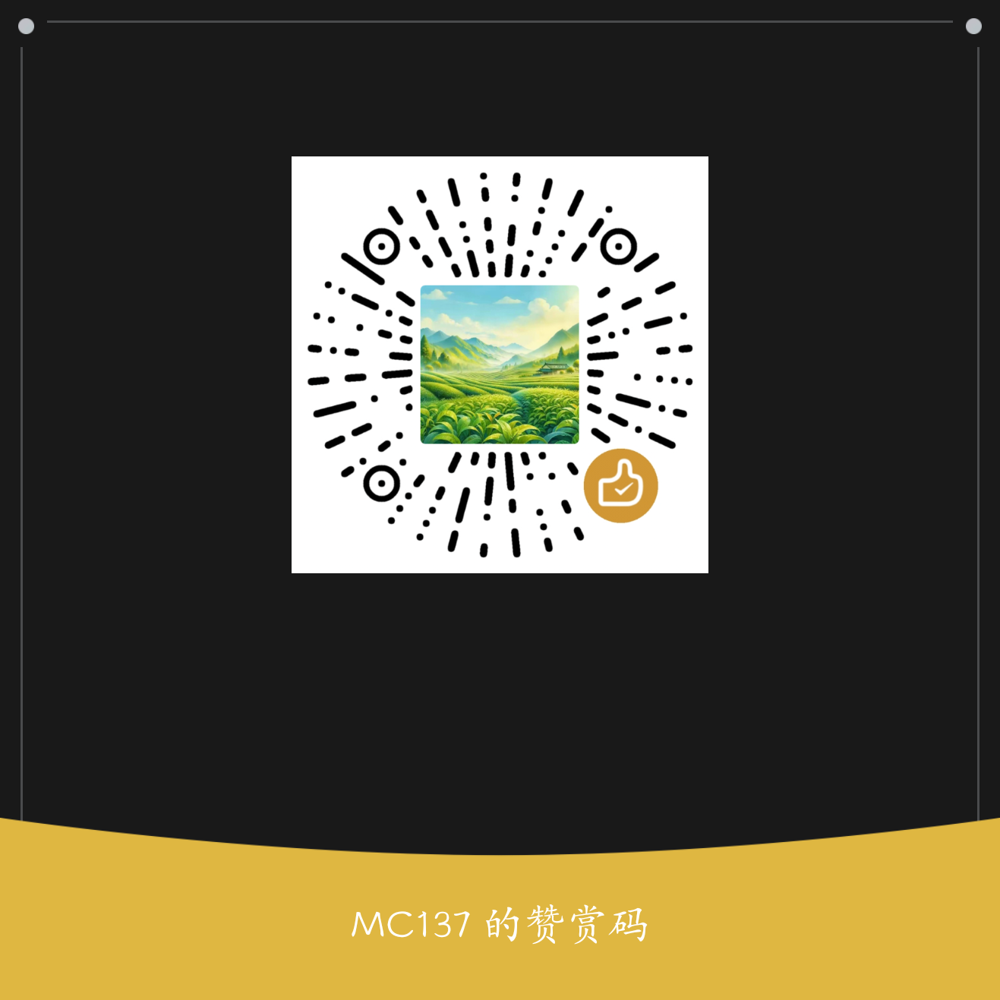

# Python 学习记录

> 一个面向入门者的 Python 进阶学习资源包

## 项目简介

本项目整理了从基础到高级的 Python 知识体系，包含：

- **知识笔记**：按章节组织的系统化知识点
- **工具代码**：可直接复用的实用工具函数和类
- **趣味代码**：展示 Python 语言特性的有趣示例

## 目录结构

```
learn/
├── 01_foundation/           # ⭐ 基础篇
│   ├── basics.md           # 变量、运算符、控制流
│   ├── data_structures.md  # 列表、字典、集合、元组
│   └── functions.md        # 函数基础、参数、作用域
│
├── 02_intermediate/         # ⭐⭐ 进阶篇
│   ├── oop.md              # 面向对象编程
│   ├── magic_methods.md    # 魔法方法详解
│   ├── decorators.md       # 装饰器原理与应用
│   ├── generators.md       # 生成器与迭代器
│   └── context_managers.md # 上下文管理器
│
├── 03_advanced/             # ⭐⭐⭐ 高级篇
│   ├── metaprogramming.md  # 元编程
│   ├── descriptors.md      # 描述符协议
│   └── abc.md              # 抽象基类
│
├── tools/                   # 工具代码库
│   ├── decorators.py       # 装饰器集合
│   ├── utils.py            # 工具函数
│   ├── trans.py            # 翻译模块
│   └── mission.py          # 并行任务等工具类
│
├── examples/               # 使用示例
│   ├── 01_decorators_example.py
│   ├── 02_utils_example.py
│   ├── 03_mission_example.py
│   ├── 04_trans_example.py
│   └── 05_fun_example.py
│
├── fun/                     # 趣味代码
│   └── language_tricks.py  # Python 语言特性探索
│
└── write.py                 # 简单演示脚本
```

## 快速开始

### 安装依赖

```bash
# 核心功能无需额外依赖

# 可选依赖（翻译功能）
pip install translate langdetect

# 可选依赖（进度条）
pip install tqdm

# 可选依赖（备用翻译服务）
pip install uapi
```

### 使用工具模块

```python
from tools import log, catch, trans, Mission

# 日志装饰器
@log
def fibonacci(n):
    if n <= 1:
        return n
    return fibonacci(n-1) + fibonacci(n-2)

# 异常捕获
@catch
def risky_operation():
    return 1 / 0

# 翻译
result = trans.translate("Hello World", target_lang="zh")

# 并行任务
mission = Mission()
mission.add(task_func, arg1, arg2)
for result in mission:
    print(result)
```

## 学习路径

| 阶段 | 内容 | 难度 |
|------|------|------|
| 基础篇 | 变量、运算符、控制流、数据结构、函数 | ⭐ |
| 进阶篇 | 面向对象、魔法方法、装饰器、生成器 | ⭐⭐ |
| 高级篇 | 元编程、描述符、抽象基类 | ⭐⭐⭐ |

## 示例代码

`examples/` 目录提供了各模块的使用示例：

| 文件 | 内容 |
|------|------|
| `01_decorators_example.py` | 装饰器使用示例 |
| `02_utils_example.py` | 工具函数使用示例 |
| `03_mission_example.py` | 工具类使用示例 |
| `04_trans_example.py` | 翻译功能使用示例 |
| `05_fun_example.py` | 语言特性趣味示例 |

运行示例：
```bash
python examples/01_decorators_example.py
```

## 难度标注说明

- ⭐ 入门：适合刚学完基础语法的初学者
- ⭐⭐ 进阶：适合有一定项目经验的开发者
- ⭐⭐⭐ 高级：适合想深入理解 Python 内部机制的进阶者

## 工具模块说明

### 装饰器

| 装饰器 | 功能 |
|--------|------|
| `@log` | 函数执行日志（参数、返回值、耗时） |
| `@catch` | 异常捕获与处理 |
| `@now` | 模块导入时立即执行 |
| `@reg` | 函数注册收集 |
| `@Dec` | 可链式调用的可变装饰器 |
| `@abc_def` | 严格抽象基类检查 |

### 全局控制

| 名称 | 类型 | 功能 |
|------|------|------|
| `OPEN` | bool | 控制 `@now` 装饰器是否执行 |
| `set_OPEN(bool)` | 函数 | 设置 OPEN 变量 |

### 工具类

| 类 | 功能 |
|----|------|
| `Trans` | 翻译类（支持缓存） |
| `Mission` | 多进程并行任务 |
| `Catch` | 异常捕获上下文管理器 |
| `TestFile` | 临时测试文件 |
| `Create` | 快速创建数据结构 |
| `Frange` | 范围生成器 |

### 实例对象

| 实例 | 类 | 功能 |
|------|------|------|
| `trans` | Trans | 翻译器单例 |
| `crt` | Create | 快速创建随机数据结构 |
| `r` | Frange | 范围生成器 |

### 辅助函数

| 函数 | 功能 |
|------|------|
| `show(iterable)` | 安全查看可迭代对象 |
| `see(obj)` | 查看对象属性和方法 |
| `every(iterable)` | 扁平化嵌套结构 |
| `r_step(iterable, n)` | 分组生成器 |
| `check(*names)` | 命名冲突检查 |
| `bases(obj)` | 查看继承树 |
| `line(char)` | 终端分隔线 |
| `count_chars(path)` | 统计文件字符数 |
| `time_data()` | 获取当前时间字符串 |
| `doc()` | 打印模块文档字符串 |

## 注意事项

### 趣味代码模块

`fun/language_tricks.py` 中的代码仅供学习 Python 语言特性参考，**不建议在生产环境使用**。

### 生产环境建议

| 学习代码 | 生产替代 |
|---------|---------|
| `@log` + `print` | `logging` 模块 |
| `time.time()` | `time.perf_counter()` |
| `@catch` 吞掉异常 | 明确的异常处理策略 |

## 版本要求

- Python 3.10+（使用了 match-case 语法）

## 许可证

本项目采用 [CC BY-NC-SA 4.0](LICENSE) 许可协议。

- ✅ 允许分享和修改
- ❌ 禁止商业使用
- 🔄 演绎作品需使用相同许可

## ☕ 支持作者

如果这个项目对你有帮助，欢迎请我喝杯咖啡 ☕

### 微信赞赏


**无条件赞助，金额随意，感谢支持！**